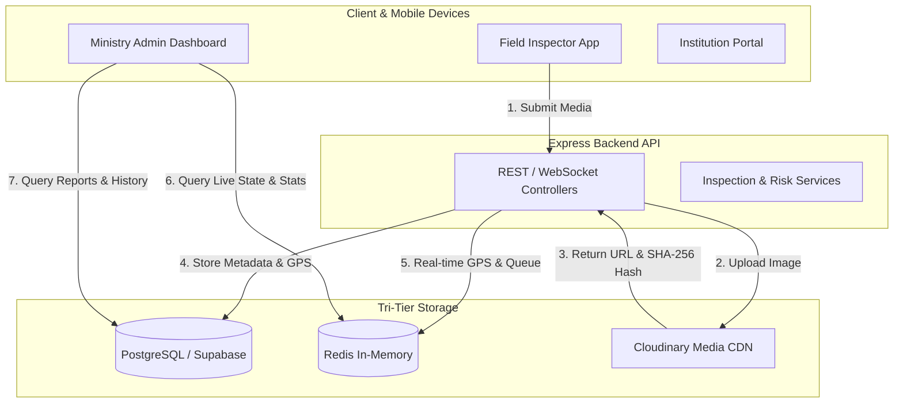

# SmartInspect Database & Entity-Relationship (ER) Architecture 🛡️
### *Smart Real-Time Monitoring & Inspection Platform for MoSJE (SIH26-26095)*

---

## 1. Overview & Purpose

The **SmartInspect** platform provides transparent, tamper-evident, and real-time oversight for welfare institutions and Grant-in-Aid NGOs operating under the **Ministry of Social Justice and Empowerment (MoSJE)**. 

This document defines the complete relational database blueprint, storage partitioning strategy (PostgreSQL vs Redis vs Cloudinary), indexing scheme, and data lifecycle management for the MVP.

---

## 2. Core Architectural Design Principles

1. **Relational Integrity with Scalable Normalization**: Standard 3NF normalized tables for core entities (Users, Institutions, Inspections, Checklists, Reports, Compliance), using structured JSONB only where schema flexibility is strictly required (AI factor weights, audit diff snapshots).
2. **Current State vs Immutable History**:
   - `Inspection.currentInspectorId` maintains the active inspector pointer for operational convenience and fast querying, while `InspectionAssignment` maintains the immutable dispatch/reassignment history.
   - `Institution.latestRiskScore` and `Institution.latestRiskLevel` provide denormalized fast-query snapshots, while `RiskAssessment` records the append-only historical audit trail.
3. **Tri-Tier Storage Strategy**:
   - **PostgreSQL (Supabase)**: Persistent transactional records, relational links, and audit history.
   - **Cloudinary**: Binary media assets (geo-tagged photos, video recordings, PDF dossiers, digital signatures).
   - **Redis**: Ephemeral live GPS tracking, WebSocket connections, BullMQ background job queues, and dashboard caching.
4. **Evidence & Cryptographic Integrity**:
   - SHA-256 hashes in `Evidence.fileHash` guarantee post-capture file integrity and deduplication (tamper-evidence).
   - GPS and timestamp authenticity is validated via server-side geofence cross-checks with `GpsVerification`.
5. **Polymorphic Auditing**:
   - `AuditLog.entityId` is a standalone UUID without a database-level Foreign Key constraint to accommodate polymorphic logging across different entity types (`INSPECTION`, `INSTITUTION`, `USER`, etc.), enforced via application-level validation.

---

## 3. Storage Architecture: PostgreSQL vs Redis vs Cloudinary

### Storage Responsibility Matrix

| Data Category | Target Store | Rationale & Examples |
|---|---|---|
| **Entities, Schemes, Reports, Checklists** | **PostgreSQL** | Relational consistency, foreign keys, ACID compliance, and SQL analytics. |
| **Audit Logs & Historical Assessments** | **PostgreSQL (Immutable)** | Permanent legal compliance record for government accountability. |
| **Media Files (Photos/Videos/PDFs)** | **Cloudinary** | Offloads large binaries from the database; provides edge CDN delivery, format optimization, and watermarking. |
| **Cryptographic Evidence Metadata** | **PostgreSQL** | Stores SHA-256 hash, Cloudinary public ID, capture timestamp, and GPS coordinates for tamper verification. |
| **Real-time Inspector Presence & Live Pings** | **Redis** | High write frequency (e.g. 5-second GPS pings) that does not need permanent relational storage. |
| **Background Processing Queues** | **Redis (BullMQ)** | Asynchronous AI image analysis, PDF report compilation, and notification dispatches. |
| **Dashboard Aggregation Cache** | **Redis** | Short-lived caching (TTL 30–60s) for high-traffic executive KPI summaries. |

---

## 4. Enumerations (Enums)

| Enum Name | Values | Purpose |
|---|---|---|
| `UserRole` | `ADMIN`, `STATE_OFFICER`, `DISTRICT_OFFICER`, `INSPECTOR`, `INSTITUTION_USER` | Role-based authorization levels. |
| `InspectorStatus` | `AVAILABLE`, `ON_DUTY`, `ON_LEAVE`, `INACTIVE` | Inspector real-time availability. |
| `InstitutionType` | `SENIOR_CITIZEN_HOME`, `DE_ADDICTION_CENTRE`, `RESIDENTIAL_HOSTEL_SC_OBC`, `DIVYANGJAN_REHAB_CENTRE`, `NGO_AIDED_CENTRE`, `OTHER` | Types of institutions under MoSJE. |
| `InstitutionStatus` | `ACTIVE`, `SUSPENDED`, `UNDER_SCRUTINY`, `CLOSED` | Operational compliance status. |
| `RiskLevel` | `LOW`, `MEDIUM`, `HIGH`, `CRITICAL` | Composite risk categorization. |
| `InspectionType` | `SCHEDULED`, `SURPRISE`, `FOLLOW_UP`, `COMPLAINT_DRIVEN` | Triggering reason for an inspection. |
| `InspectionStatus` | `PLANNED`, `ASSIGNED`, `ACCEPTED`, `IN_PROGRESS`, `COMPLETED`, `REPORT_SUBMITTED`, `UNDER_REVIEW`, `APPROVED`, `REJECTED`, `CANCELLED` | Complete lifecycle state machine. |
| `AssignmentMethod` | `RANDOM_AUTOMATED`, `MANUAL_DISPATCH`, `RISK_TRIGGERED` | Dispatch mechanism for transparency. |
| `AssignmentStatus` | `PENDING`, `ACCEPTED`, `DECLINED`, `REASSIGNED` | Inspector assignment acceptance flow. |
| `GpsVerificationType` | `CHECK_IN`, `CHECK_OUT`, `INTERMEDIATE_PING` | Location verification checkpoints. |
| `ChecklistCategory` | `INFRASTRUCTURE`, `HYGIENE_SANITATION`, `FOOD_NUTRITION`, `MEDICAL_CARE`, `SAFETY_FIRE`, `STAFF_BENEFICIARY_RATIO`, `DOCUMENT_REGISTERS` | Domain categories for inspection audit. |
| `ResponseOption` | `PASS`, `FAIL`, `NA` | Standardized checklist evaluation outcome. |
| `MediaType` | `IMAGE`, `VIDEO`, `DOCUMENT_PDF`, `DIGITAL_SIGNATURE` | Uploaded evidence format. |
| `MediaCategory` | `KITCHEN_FOOD`, `WASHROOM_SANITATION`, `DORMITORY`, `FIRE_SAFETY`, `ATTENDANCE_REGISTER`, `SUPERINTENDENT_SIGNATURE`, `INSPECTOR_SIGNATURE`, `GENERAL` | Purpose of captured evidence. |
| `ComplianceStatus` | `COMPLIANT`, `PARTIALLY_COMPLIANT`, `NON_COMPLIANT` | Overall facility audit result. |
| `ComplianceActionStatus` | `PENDING`, `IN_PROGRESS`, `SUBMITTED_FOR_REVIEW`, `VERIFIED_CLOSED`, `ESCALATED` | Lifecycle of corrective action items. |
| `AlertSeverity` | `LOW`, `MEDIUM`, `HIGH`, `CRITICAL` | Priority of system-generated warnings. |
| `AlertStatus` | `OPEN`, `ACKNOWLEDGED`, `IN_PROGRESS`, `RESOLVED`, `DISMISSED` | Alert workflow status. |
| `CctvStatus` | `ONLINE`, `OFFLINE`, `FAULTY` | Status of simulated or connected cameras. |

---

## 5. Entity Specifications

### 5.1 Identity & User Management

#### 1. `User`
* **Purpose**: Core identity entity for all platform actors.
* **Fields**:
  * `id`: UUID (PK)
  * `email`: VARCHAR(255) (Unique, Not Null)
  * `passwordHash`: VARCHAR(255) (Not Null)
  * `fullName`: VARCHAR(150) (Not Null)
  * `phone`: VARCHAR(20) (Unique, Not Null)
  * `role`: Enum `UserRole` (Not Null, Default: `INSPECTOR`)
  * `state`: VARCHAR(100) (Nullable — jurisdiction for State/District officers)
  * `district`: VARCHAR(100) (Nullable — jurisdiction for District officers)
  * `institutionId`: UUID (Nullable, FK $\rightarrow$ `Institution.id` for `INSTITUTION_USER`)
  * `isActive`: BOOLEAN (Default: `true`)
  * `lastLoginAt`: TIMESTAMP (Nullable)
  * `createdAt`: TIMESTAMP (Default: `NOW()`)
  * `updatedAt`: TIMESTAMP (Auto-updated)
  * `deletedAt`: TIMESTAMP (Nullable — Soft Delete)

#### 2. `InspectorProfile`
* **Purpose**: Extended domain profile for field inspection officers.
* **Fields**:
  * `id`: UUID (PK)
  * `userId`: UUID (Unique, Not Null, FK $\rightarrow$ `User.id`)
  * `badgeNumber`: VARCHAR(50) (Unique, Not Null)
  * `designation`: VARCHAR(100) (Not Null)
  * `assignedDistrict`: VARCHAR(100) (Not Null)
  * `status`: Enum `InspectorStatus` (Default: `AVAILABLE`)
  * `totalInspectionsConducted`: INTEGER (Default: 0)
  * `createdAt`: TIMESTAMP (Default: `NOW()`)
  * `updatedAt`: TIMESTAMP (Auto-updated)

---

### 5.2 Institutions, Schemes & Attendance

#### 3. `Institution`
* **Purpose**: Physical beneficiary facility, NGO, or rehabilitation centre under MoSJE.
* **Fields**:
  * `id`: UUID (PK)
  * `code`: VARCHAR(50) (Unique, Not Null — NGO Darpan ID or Govt Registry ID)
  * `name`: VARCHAR(255) (Not Null)
  * `type`: Enum `InstitutionType` (Not Null)
  * `registrationNumber`: VARCHAR(100) (Not Null)
  * `address`: TEXT (Not Null)
  * `state`: VARCHAR(100) (Not Null)
  * `district`: VARCHAR(100) (Not Null)
  * `pincode`: VARCHAR(10) (Not Null)
  * `latitude`: DECIMAL(10, 7) (Not Null — reference for geofencing)
  * `longitude`: DECIMAL(10, 7) (Not Null — reference for geofencing)
  * `geofenceRadiusMeters`: INTEGER (Default: 150)
  * `contactPerson`: VARCHAR(150) (Not Null)
  * `contactPhone`: VARCHAR(20) (Not Null)
  * `contactEmail`: VARCHAR(255) (Nullable)
  * `capacity`: INTEGER (Default: 0)
  * `currentOccupancy`: INTEGER (Default: 0)
  * `status`: Enum `InstitutionStatus` (Default: `ACTIVE`)
  * `latestRiskScore`: DECIMAL(5, 2) (Default: 0.00 — *Denormalized current snapshot 0 to 100 for fast query/filtering*)
  * `latestRiskLevel`: Enum `RiskLevel` (Default: `LOW` — *Denormalized current snapshot*)
  * `isAidedByGovt`: BOOLEAN (Default: `true`)
  * `createdAt`: TIMESTAMP (Default: `NOW()`)
  * `updatedAt`: TIMESTAMP (Auto-updated)
  * `deletedAt`: TIMESTAMP (Nullable — Soft Delete)

#### 4. `Scheme`
* **Purpose**: Government programs/grants under MoSJE (e.g., NAPDDR, PM-DAKSH, Senior Citizen Welfare Fund).
* **Fields**:
  * `id`: UUID (PK)
  * `code`: VARCHAR(50) (Unique, Not Null)
  * `name`: VARCHAR(255) (Not Null)
  * `description`: TEXT (Nullable)
  * `sponsoringDepartment`: VARCHAR(200) (Not Null)
  * `isActive`: BOOLEAN (Default: `true`)
  * `createdAt`: TIMESTAMP (Default: `NOW()`)

#### 5. `InstitutionScheme` (Join Entity: `M:N`)
* **Purpose**: Association between institutions and the welfare schemes they implement.
* **Fields**:
  * `id`: UUID (PK)
  * `institutionId`: UUID (Not Null, FK $\rightarrow$ `Institution.id`)
  * `schemeId`: UUID (Not Null, FK $\rightarrow$ `Scheme.id`)
  * `grantSanctionedAmount`: DECIMAL(15, 2) (Default: 0.00)
  * `grantYear`: VARCHAR(10) (Not Null)
  * `approvalStatus`: VARCHAR(50) (Default: `"SANCTIONED"`)
  * `createdAt`: TIMESTAMP (Default: `NOW()`)

#### 6. `Beneficiary`
* **Purpose**: Aggregate/baseline beneficiary records enrolled at the institution (minimizes sensitive PII for MVP).
* **Fields**:
  * `id`: UUID (PK)
  * `institutionId`: UUID (Not Null, FK $\rightarrow$ `Institution.id`)
  * `schemeId`: UUID (Nullable, FK $\rightarrow$ `Scheme.id`)
  * `enrollmentNumber`: VARCHAR(50) (Not Null)
  * `fullName`: VARCHAR(150) (Not Null)
  * `gender`: VARCHAR(20) (Not Null)
  * `category`: VARCHAR(50) (Not Null — e.g. Senior, SC, OBC, Divyangjan)
  * `age`: INTEGER (Not Null)
  * `admissionDate`: DATE (Not Null)
  * `status`: VARCHAR(50) (Default: `"ENROLLED"`)
  * `createdAt`: TIMESTAMP (Default: `NOW()`)
  * `updatedAt`: TIMESTAMP (Auto-updated)
  * `deletedAt`: TIMESTAMP (Nullable — Soft Delete)

#### 7. `InstitutionAttendance`
* **Purpose**: Aggregated institution-level attendance records for baseline verification and AI anomaly comparison during audits.
* **Fields**:
  * `id`: UUID (PK)
  * `institutionId`: UUID (Not Null, FK $\rightarrow$ `Institution.id`)
  * `attendanceDate`: DATE (Not Null)
  * `totalPresent`: INTEGER (Not Null)
  * `totalEnrolled`: INTEGER (Not Null)
  * `verifiedByInspectionId`: UUID (Nullable, FK $\rightarrow$ `Inspection.id`)
  * `anomalyFlag`: BOOLEAN (Default: `false`)
  * `notes`: TEXT (Nullable)
  * `createdAt`: TIMESTAMP (Default: `NOW()`)

---

### 5.3 Inspection Workflow & Assignment

#### 8. `Inspection`
* **Purpose**: The central entity representing a scheduled or surprise physical audit.
* **Fields**:
  * `id`: UUID (PK)
  * `inspectionCode`: VARCHAR(50) (Unique, Not Null — e.g. `INSP-2026-0001`)
  * `institutionId`: UUID (Not Null, FK $\rightarrow$ `Institution.id`)
  * `currentInspectorId`: UUID (Nullable, FK $\rightarrow$ `User.id` — *Active inspector assigned to conduct the inspection*)
  * `assignedById`: UUID (Nullable, FK $\rightarrow$ `User.id` — Null if auto-assigned)
  * `type`: Enum `InspectionType` (Default: `SCHEDULED`)
  * `status`: Enum `InspectionStatus` (Default: `PLANNED`)
  * `scheduledDate`: DATE (Not Null)
  * `startedAt`: TIMESTAMP (Nullable)
  * `completedAt`: TIMESTAMP (Nullable)
  * `overallScore`: DECIMAL(5, 2) (Nullable — 0 to 100)
  * `complianceStatus`: Enum `ComplianceStatus` (Nullable)
  * `riskLevelAtInspection`: Enum `RiskLevel` (Nullable)
  * `isGeofenceVerified`: BOOLEAN (Default: `false`)
  * `remarks`: TEXT (Nullable)
  * `createdAt`: TIMESTAMP (Default: `NOW()`)
  * `updatedAt`: TIMESTAMP (Auto-updated)

#### 9. `InspectionAssignment`
* **Purpose**: Immutable dispatch ledger ensuring transparency of manual, randomized, or reassigned inspector dispatches.
* **Fields**:
  * `id`: UUID (PK)
  * `inspectionId`: UUID (Not Null, FK $\rightarrow$ `Inspection.id`)
  * `inspectorId`: UUID (Not Null, FK $\rightarrow$ `User.id`)
  * `assignedById`: UUID (Nullable, FK $\rightarrow$ `User.id`)
  * `assignmentMethod`: Enum `AssignmentMethod` (Default: `RANDOM_AUTOMATED`)
  * `algorithmSeed`: VARCHAR(100) (Nullable — algorithmic transparency hash/seed)
  * `status`: Enum `AssignmentStatus` (Default: `PENDING`)
  * `declineReason`: TEXT (Nullable)
  * `assignedAt`: TIMESTAMP (Default: `NOW()`)
  * `respondedAt`: TIMESTAMP (Nullable)

#### 10. `GpsVerification`
* **Purpose**: Timestamped cryptographic proof of inspector presence within the geofence perimeter.
* **Fields**:
  * `id`: UUID (PK)
  * `inspectionId`: UUID (Not Null, FK $\rightarrow$ `Inspection.id`)
  * `inspectorId`: UUID (Not Null, FK $\rightarrow$ `User.id`)
  * `verificationType`: Enum `GpsVerificationType` (Not Null)
  * `latitude`: DECIMAL(10, 7) (Not Null)
  * `longitude`: DECIMAL(10, 7) (Not Null)
  * `accuracyMeters`: DECIMAL(6, 2) (Not Null)
  * `distanceFromInstitutionMeters`: DECIMAL(8, 2) (Not Null)
  * `isWithinGeofence`: BOOLEAN (Not Null)
  * `deviceInfo`: VARCHAR(255) (Nullable)
  * `tamperFlag`: BOOLEAN (Default: `false` — flags mock locations or impossible velocity)
  * `capturedAt`: TIMESTAMP (Default: `NOW()`)

---

### 5.4 Checklists & Evidence Collection

#### 11. `ChecklistTemplate`
* **Purpose**: Standardized questionnaires configured per institution type.
* **Fields**:
  * `id`: UUID (PK)
  * `name`: VARCHAR(200) (Not Null)
  * `institutionType`: Enum `InstitutionType` (Not Null)
  * `version`: INTEGER (Default: 1)
  * `isActive`: BOOLEAN (Default: `true`)
  * `createdAt`: TIMESTAMP (Default: `NOW()`)

#### 12. `ChecklistItem`
* **Purpose**: Individual audit criteria within a template.
* **Fields**:
  * `id`: UUID (PK)
  * `templateId`: UUID (Not Null, FK $\rightarrow$ `ChecklistTemplate.id`)
  * `category`: Enum `ChecklistCategory` (Not Null)
  * `questionText`: TEXT (Not Null)
  * `guidelines`: TEXT (Nullable)
  * `weightage`: DECIMAL(4, 2) (Default: 1.00)
  * `isMandatory`: BOOLEAN (Default: `true`)
  * `requiresPhotoEvidence`: BOOLEAN (Default: `false`)
  * `orderIndex`: INTEGER (Default: 0)
  * `createdAt`: TIMESTAMP (Default: `NOW()`)

#### 13. `InspectionChecklistResponse`
* **Purpose**: Recorded inspector answers and score calculations.
* **Fields**:
  * `id`: UUID (PK)
  * `inspectionId`: UUID (Not Null, FK $\rightarrow$ `Inspection.id`)
  * `checklistItemId`: UUID (Not Null, FK $\rightarrow$ `ChecklistItem.id`)
  * `response`: Enum `ResponseOption` (Not Null)
  * `scoreAwarded`: DECIMAL(4, 2) (Default: 0.00)
  * `inspectorNotes`: TEXT (Nullable)
  * `isDeficiency`: BOOLEAN (Default: `false`)
  * `aiFlaggedAnomaly`: BOOLEAN (Default: `false`)
  * `createdAt`: TIMESTAMP (Default: `NOW()`)

#### 14. `Evidence`
* **Purpose**: Cryptographic metadata and Cloudinary pointers for photos, videos, and signatures.
* **Fields**:
  * `id`: UUID (PK)
  * `inspectionId`: UUID (Not Null, FK $\rightarrow$ `Inspection.id`)
  * `checklistItemId`: UUID (Nullable, FK $\rightarrow$ `ChecklistItem.id`)
  * `inspectorId`: UUID (Not Null, FK $\rightarrow$ `User.id`)
  * `mediaType`: Enum `MediaType` (Default: `IMAGE`)
  * `category`: Enum `MediaCategory` (Default: `GENERAL`)
  * `cloudinaryPublicId`: VARCHAR(255) (Not Null)
  * `cloudinaryUrl`: TEXT (Not Null)
  * `secureUrl`: TEXT (Not Null)
  * `fileSizeBytes`: BIGINT (Not Null — file size in bytes)
  * `fileHash`: VARCHAR(64) (Not Null — SHA-256 payload integrity hash for tamper-evidence and deduplication)
  * `latitude`: DECIMAL(10, 7) (Not Null — EXIF/device location recorded at capture)
  * `longitude`: DECIMAL(10, 7) (Not Null)
  * `capturedAt`: TIMESTAMP (Not Null)
  * `isWatermarked`: BOOLEAN (Default: `true`)
  * `aiSanitationScore`: DECIMAL(4, 2) (Nullable — *MVP AI field; can be extracted to EvidenceAnalysis in post-MVP*)
  * `aiDamageDetected`: BOOLEAN (Default: `false`)
  * `aiConfidence`: DECIMAL(4, 2) (Nullable)
  * `aiNotes`: TEXT (Nullable)
  * `createdAt`: TIMESTAMP (Default: `NOW()`)

> [!NOTE]
> **Integrity vs Authenticity Clarification**: The SHA-256 `fileHash` ensures cryptographic file integrity (detects byte-level tampering or duplicate uploads post-creation). Verification of the GPS and EXIF capture timestamp itself relies on client device attestation and backend cross-referencing against the active `GpsVerification` check-in geofence.

---

### 5.5 Reports, Compliance & Intelligence

#### 15. `InspectionReport`
* **Purpose**: The final consolidated inspection dossier and digital sign-off.
* **Fields**:
  * `id`: UUID (PK)
  * `inspectionId`: UUID (Unique, Not Null, FK $\rightarrow$ `Inspection.id`)
  * `reportNumber`: VARCHAR(50) (Unique, Not Null)
  * `executiveSummary`: TEXT (Not Null)
  * `keyDeficiencies`: JSONB (Nullable — structured list of major issues)
  * `infrastructureScore`: DECIMAL(5, 2) (Default: 0.00)
  * `hygieneScore`: DECIMAL(5, 2) (Default: 0.00)
  * `foodNutritionScore`: DECIMAL(5, 2) (Default: 0.00)
  * `medicalCareScore`: DECIMAL(5, 2) (Default: 0.00)
  * `finalScore`: DECIMAL(5, 2) (Default: 0.00)
  * `inspectorSignatureUrl`: TEXT (Nullable — Cloudinary URL)
  * `superintendentSignatureUrl`: TEXT (Nullable — Cloudinary URL)
  * `pdfReportUrl`: TEXT (Nullable — generated PDF in Cloudinary)
  * `submittedAt`: TIMESTAMP (Default: `NOW()`)
  * `reviewedAt`: TIMESTAMP (Nullable)
  * `reviewedById`: UUID (Nullable, FK $\rightarrow$ `User.id`)
  * `approvalStatus`: VARCHAR(50) (Default: `"SUBMITTED"`)

#### 16. `RiskAssessment`
* **Purpose**: Append-only historical source of truth for all AI and rule-based risk calculations per institution.
* **Fields**:
  * `id`: UUID (PK)
  * `institutionId`: UUID (Not Null, FK $\rightarrow$ `Institution.id`)
  * `assessmentDate`: TIMESTAMP (Default: `NOW()`)
  * `riskScore`: DECIMAL(5, 2) (Not Null — 0 to 100)
  * `riskLevel`: Enum `RiskLevel` (Not Null)
  * `factors`: JSONB (Not Null — weighted factors: attendance variance, past violations, CCTV uptime, etc.)
  * `modelVersion`: VARCHAR(50) (Default: `"v1.0.0"`)
  * `triggeredBy`: VARCHAR(100) (Default: `"SCHEDULED_CRON"`)
  * `recommendedAction`: VARCHAR(255) (Nullable)
  * `createdAt`: TIMESTAMP (Default: `NOW()`)

#### 17. `ComplianceAction`
* **Purpose**: Corrective Action Plan (CAP) generated from inspection deficiencies.
* **Fields**:
  * `id`: UUID (PK)
  * `inspectionId`: UUID (Not Null, FK $\rightarrow$ `Inspection.id`)
  * `institutionId`: UUID (Not Null, FK $\rightarrow$ `Institution.id`)
  * `checklistItemId`: UUID (Nullable, FK $\rightarrow$ `ChecklistItem.id`)
  * `title`: VARCHAR(255) (Not Null)
  * `description`: TEXT (Not Null)
  * `severity`: Enum `AlertSeverity` (Default: `MEDIUM`)
  * `deadline`: DATE (Not Null)
  * `status`: Enum `ComplianceActionStatus` (Default: `PENDING`)
  * `assignedToUserId`: UUID (Nullable, FK $\rightarrow$ `User.id` — Institution Head)
  * `createdByUserId`: UUID (Not Null, FK $\rightarrow$ `User.id` — Officer)
  * `institutionResponse`: TEXT (Nullable)
  * `resolutionEvidenceUrl`: TEXT (Nullable)
  * `verifiedAt`: TIMESTAMP (Nullable)
  * `verifiedById`: UUID (Nullable, FK $\rightarrow$ `User.id`)
  * `createdAt`: TIMESTAMP (Default: `NOW()`)
  * `updatedAt`: TIMESTAMP (Auto-updated)

#### 18. `Alert`
* **Purpose**: High-priority anomaly notifications requiring administrative intervention.
* **Fields**:
  * `id`: UUID (PK)
  * `institutionId`: UUID (Not Null, FK $\rightarrow$ `Institution.id`)
  * `inspectionId`: UUID (Nullable, FK $\rightarrow$ `Inspection.id`)
  * `alertType`: VARCHAR(100) (Not Null — e.g. `HIGH_RISK_SURGE`, `ATTENDANCE_DROP`, `GEOFENCE_BREACH`)
  * `severity`: Enum `AlertSeverity` (Default: `MEDIUM`)
  * `title`: VARCHAR(255) (Not Null)
  * `description`: TEXT (Not Null)
  * `status`: Enum `AlertStatus` (Default: `OPEN`)
  * `acknowledgedById`: UUID (Nullable, FK $\rightarrow$ `User.id`)
  * `acknowledgedAt`: TIMESTAMP (Nullable)
  * `resolvedAt`: TIMESTAMP (Nullable)
  * `resolutionNotes`: TEXT (Nullable)
  * `createdAt`: TIMESTAMP (Default: `NOW()`)

---

### 5.6 Devices, Notifications & Governance

#### 19. `CctvDevice`
* **Purpose**: Metadata registry for physical/simulated CCTV feeds.
* **Fields**:
  * `id`: UUID (PK)
  * `institutionId`: UUID (Not Null, FK $\rightarrow$ `Institution.id`)
  * `deviceName`: VARCHAR(100) (Not Null)
  * `cameraLocation`: VARCHAR(100) (Not Null — e.g. "Main Gate", "Dining Hall")
  * `streamUrl`: TEXT (Not Null)
  * `status`: Enum `CctvStatus` (Default: `ONLINE`)
  * `lastPingAt`: TIMESTAMP (Default: `NOW()`)
  * `isAiMonitoringEnabled`: BOOLEAN (Default: `false`)
  * `createdAt`: TIMESTAMP (Default: `NOW()`)

#### 20. `Notification`
* **Purpose**: User inbox notifications (inspection dispatched, report approved, compliance alert).
* **Fields**:
  * `id`: UUID (PK)
  * `userId`: UUID (Not Null, FK $\rightarrow$ `User.id`)
  * `title`: VARCHAR(200) (Not Null)
  * `message`: TEXT (Not Null)
  * `type`: VARCHAR(100) (Not Null)
  * `linkUrl`: VARCHAR(255) (Nullable)
  * `isRead`: BOOLEAN (Default: `false`)
  * `readAt`: TIMESTAMP (Nullable)
  * `createdAt`: TIMESTAMP (Default: `NOW()`)

#### 21. `AuditLog`
* **Purpose**: Permanent, immutable ledger of all critical operations for anti-fraud auditing.
* **Fields**:
  * `id`: UUID (PK)
  * `actorUserId`: UUID (Nullable, FK $\rightarrow$ `User.id` — Null if automated system task)
  * `action`: VARCHAR(100) (Not Null — e.g. `CREATE_INSPECTION`, `SUBMIT_REPORT`, `GEOFENCE_CHECKIN`)
  * `entityType`: VARCHAR(100) (Not Null — e.g. `INSPECTION`, `EVIDENCE`, `COMPLIANCE`)
  * `entityId`: UUID (Not Null — *Polymorphic identifier without database FK; validated at application layer*)
  * `oldValues`: JSONB (Nullable)
  * `newValues`: JSONB (Nullable)
  * `ipAddress`: VARCHAR(45) (Nullable)
  * `userAgent`: VARCHAR(255) (Nullable)
  * `timestamp`: TIMESTAMP (Default: `NOW()`)

---

## 6. Complete Mermaid ER Diagram

```mermaid
erDiagram
    USER ||--o| INSPECTOR_PROFILE : "has profile"
    USER ||--o{ INSPECTION : "currently assigned to"
    USER ||--o{ INSPECTION : "assigns (as officer)"
    USER ||--o{ INSPECTION_ASSIGNMENT : "assigned / created"
    USER ||--o{ NOTIFICATION : "receives"
    USER ||--o{ AUDIT_LOG : "triggers"
    USER }o--o| INSTITUTION : "manages (if institution user)"

    INSTITUTION ||--o{ INSTITUTION_SCHEME : "implements"
    SCHEME ||--o{ INSTITUTION_SCHEME : "funded by"
    INSTITUTION ||--o{ BENEFICIARY : "houses"
    SCHEME ||--o{ BENEFICIARY : "enrolled in"
    INSTITUTION ||--o{ INSTITUTION_ATTENDANCE : "records daily roll"
    INSTITUTION ||--o{ INSPECTION : "inspected by"
    INSTITUTION ||--o{ RISK_ASSESSMENT : "evaluated historically by"
    INSTITUTION ||--o{ ALERT : "raises"
    INSTITUTION ||--o{ COMPLIANCE_ACTION : "subject to"
    INSTITUTION ||--o{ CCTV_DEVICE : "monitored by"

    CHECKLIST_TEMPLATE ||--o{ CHECKLIST_ITEM : "contains"
    
    INSPECTION ||--o{ INSPECTION_ASSIGNMENT : "dispatch history"
    INSPECTION ||--o{ GPS_VERIFICATION : "verified by"
    INSPECTION ||--o{ INSPECTION_CHECKLIST_RESPONSE : "contains"
    CHECKLIST_ITEM ||--o{ INSPECTION_CHECKLIST_RESPONSE : "answered by"
    INSPECTION ||--o{ EVIDENCE : "collects"
    CHECKLIST_ITEM ||--o{ EVIDENCE : "evidenced for"
    INSPECTION ||--o| INSPECTION_REPORT : "generates"
    INSPECTION ||--o{ COMPLIANCE_ACTION : "triggers"
    INSPECTION ||--o{ ALERT : "triggers"

    USER {
        uuid id PK
        string email UK
        string phone UK
        enum role
        string state
        string district
        uuid institutionId FK
        boolean isActive
    }

    INSPECTOR_PROFILE {
        uuid id PK
        uuid userId FK
        string badgeNumber UK
        string assignedDistrict
        enum status
        int totalInspectionsConducted
    }

    INSTITUTION {
        uuid id PK
        string code UK
        string name
        enum type
        string state
        string district
        decimal latitude
        decimal longitude
        enum status
        decimal latestRiskScore "denormalized snapshot"
        enum latestRiskLevel "denormalized snapshot"
    }

    SCHEME {
        uuid id PK
        string code UK
        string name
        string sponsoringDepartment
    }

    INSTITUTION_SCHEME {
        uuid id PK
        uuid institutionId FK
        uuid schemeId FK
        decimal grantSanctionedAmount
        string grantYear
    }

    BENEFICIARY {
        uuid id PK
        uuid institutionId FK
        uuid schemeId FK
        string enrollmentNumber
        string fullName
        string category
        int age
        date admissionDate
    }

    INSTITUTION_ATTENDANCE {
        uuid id PK
        uuid institutionId FK
        date attendanceDate
        int totalPresent
        int totalEnrolled
        boolean anomalyFlag
    }

    INSPECTION {
        uuid id PK
        string inspectionCode UK
        uuid institutionId FK
        uuid currentInspectorId FK "active inspector"
        uuid assignedById FK
        enum type
        enum status
        date scheduledDate
        decimal overallScore
        enum complianceStatus
        boolean isGeofenceVerified
    }

    INSPECTION_ASSIGNMENT {
        uuid id PK
        uuid inspectionId FK
        uuid inspectorId FK
        enum assignmentMethod
        enum status
        timestamp assignedAt
    }

    GPS_VERIFICATION {
        uuid id PK
        uuid inspectionId FK
        uuid inspectorId FK
        enum verificationType
        decimal latitude
        decimal longitude
        decimal distanceFromInstitutionMeters
        boolean isWithinGeofence
        boolean tamperFlag
    }

    CHECKLIST_TEMPLATE {
        uuid id PK
        string name
        enum institutionType
        int version
        boolean isActive
    }

    CHECKLIST_ITEM {
        uuid id PK
        uuid templateId FK
        enum category
        text questionText
        decimal weightage
        boolean requiresPhotoEvidence
    }

    INSPECTION_CHECKLIST_RESPONSE {
        uuid id PK
        uuid inspectionId FK
        uuid checklistItemId FK
        enum response
        decimal scoreAwarded
        boolean isDeficiency
        boolean aiFlaggedAnomaly
    }

    EVIDENCE {
        uuid id PK
        uuid inspectionId FK
        uuid checklistItemId FK
        uuid inspectorId FK
        enum mediaType
        enum category
        string cloudinaryPublicId
        text secureUrl
        bigint fileSizeBytes
        string fileHash "SHA-256"
        decimal latitude
        decimal longitude
        timestamp capturedAt
        decimal aiSanitationScore
        boolean aiDamageDetected
    }

    INSPECTION_REPORT {
        uuid id PK
        uuid inspectionId FK
        string reportNumber UK
        text executiveSummary
        jsonb keyDeficiencies
        decimal finalScore
        text pdfReportUrl
        timestamp submittedAt
    }

    RISK_ASSESSMENT {
        uuid id PK
        uuid institutionId FK
        decimal riskScore
        enum riskLevel
        jsonb factors
        string modelVersion
        timestamp assessmentDate "historical truth"
    }

    COMPLIANCE_ACTION {
        uuid id PK
        uuid inspectionId FK
        uuid institutionId FK
        string title
        enum severity
        date deadline
        enum status
        uuid assignedToUserId FK
    }

    ALERT {
        uuid id PK
        uuid institutionId FK
        uuid inspectionId FK
        string alertType
        enum severity
        enum status
        timestamp createdAt
    }

    CCTV_DEVICE {
        uuid id PK
        uuid institutionId FK
        string deviceName
        string cameraLocation
        text streamUrl
        enum status
        timestamp lastPingAt
    }

    NOTIFICATION {
        uuid id PK
        uuid userId FK
        string title
        text message
        boolean isRead
        timestamp createdAt
    }

    AUDIT_LOG {
        uuid id PK
        uuid actorUserId FK
        string action
        string entityType
        uuid entityId "polymorphic"
        jsonb oldValues
        jsonb newValues
        timestamp timestamp
    }
```

---

## 7. Performance & Query Indexing Strategy

| Table | Index Columns | Index Type | Query / Feature Optimization |
|---|---|---|---|
| `User` | `email` | Unique B-Tree | Fast user authentication lookups. |
| `User` | `role, state, district` | Composite B-Tree | Filter inspectors and officers by administrative jurisdiction. |
| `Institution` | `state, district` | Composite B-Tree | District and state-level dashboard filtering. |
| `Institution` | `latestRiskLevel, latestRiskScore DESC` | Composite B-Tree | High-risk institution ranking for automated surprise audit triggers. |
| `Institution` | `latitude, longitude` | Spatial / B-Tree | Proximity searches and nearest available inspector matching. |
| `Inspection` | `status, scheduledDate` | Composite B-Tree | Inspector daily schedule queries and status kanban board. |
| `Inspection` | `institutionId, createdAt DESC` | Composite B-Tree | Historical inspection dossier retrieval for a specific facility. |
| `Inspection` | `currentInspectorId, status` | Composite B-Tree | Mobile app query for an inspector's assigned and active audits. |
| `GpsVerification` | `inspectionId, verificationType` | Composite B-Tree | Instant geofence validation during check-in / check-out. |
| `Evidence` | `inspectionId, category` | Composite B-Tree | Loading photos grouped by category on the report page. |
| `Evidence` | `fileHash` | Hash / B-Tree | Anti-tampering deduplication check to prevent re-uploading old photos. |
| `InstitutionAttendance`| `institutionId, attendanceDate` | Composite B-Tree | Attendance trend charts and anomaly threshold calculations. |
| `Alert` | `status, severity, createdAt DESC` | Composite B-Tree | Ministry real-time triage inbox and critical alert badge counters. |
| `ComplianceAction` | `institutionId, status, deadline` | Composite B-Tree | Tracking overdue remediation items and automated escalation cron jobs. |
| `AuditLog` | `entityType, entityId, timestamp DESC`| Composite B-Tree | Entity-specific timeline view for administrative reviews. |

---

## 8. Data Integrity & Security Considerations

1. **Beneficiary Privacy**: Masked identifiers (`enrollmentNumber`) are used instead of national raw identifiers (such as Aadhaar) to protect vulnerable demographics in de-addiction and shelter facilities.
2. **Cryptographic Photo Verification & Authenticity**:
   - SHA-256 `fileHash` proves that uploaded media has not been altered post-capture.
   - Geotag authenticity is enforced by comparing device EXIF coordinates and capture timestamps against server-side geofence checks (`GpsVerification`).
3. **Immutability of Audit Trails**: `AuditLog`, `GpsVerification`, and `InspectionAssignment` records cannot be updated or deleted through standard API operations.

---

## 9. Future Extensions (Post-MVP)

* **EvidenceAnalysis Decoupling**: If multi-model AI vision pipelines (e.g. separate OCR, YOLO object detection, and facial blur engines) are introduced, extract AI columns from `Evidence` into a 1:N `EvidenceAnalysis` table.
* **PostGIS Upgrade**: Upgrade `latitude/longitude` columns to PostGIS `GEOGRAPHY(Point, 4326)` for complex boundary polygon geofencing.
* **Offline Conflict Resolution Ledger**: Vector clocks and optimistic sync tokens for multi-day inspections conducted in zero-connectivity remote regions.
